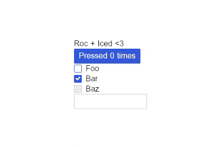

# Roc Iced

A [Roc](https://github.com/roc-lang/roc) plaform for building [Iced](https://github.com/iced-rs/iced) applications.

## Example

Run the basic example: `roc run examples/basic.roc`



```elm
app [program, Model, Message] {
    iced: platform "../platform/main.roc",
}

import iced.Color
import iced.Element.Container as Container
import iced.Element.Container exposing [container]
import iced.Element exposing [Element]
import iced.Settings exposing [Settings]

program = { init, update, view }

Model : { count : U64, isFooChecked : Bool, isBarChecked : Bool, input : Str }

Message : [
    IncrementCount,
    FooToggled Bool,
    BarToggled Bool,
    Input Str,
    Submitted,
]

init : { model : Model, settings : Settings }
init = {
    model: { count: 0, isFooChecked: Bool.false, isBarChecked: Bool.true, input: "" },
    settings: Settings.default |> Settings.size { width: 300, height: 300 },
}

update : Model, Message -> Model
update = \model, message ->
    when message is
        IncrementCount -> { model & count: model.count + 1 }
        FooToggled isFooChecked -> { model & isFooChecked }
        BarToggled isBarChecked -> { model & isBarChecked }
        Input input -> { model & input }
        Submitted -> { model & input: "" }

view : Model -> Element Message
view = \model ->
    Column [
        Text "Roc + Iced <3",
        Button {
            content: Text "Pressed $(Num.toStr model.count) times",
            onPress: Active IncrementCount,
        },
        Checkbox {
            label: "Foo",
            isChecked: model.isFooChecked,
            onToggle: Active FooToggled,
        },
        Checkbox {
            label: "Bar",
            isChecked: model.isBarChecked,
            onToggle: Active BarToggled,
        },
        Checkbox {
            label: "Baz",
            isChecked: Bool.false,
            onToggle: Disabled,
        },
        TextInput {
            value: model.input,
            width: Fixed 150,
            onInput: Active Input,
            onSubmit: Active Submitted,
        },
    ]
    |> boxed
    |> centered

centered = \elem ->
    elem
    |> container
    |> Container.center Fill

boxed = \elem ->
    background = Some (Color.fromHex 0xcad4e0ff)
    border = { width: 1, color: Color.black, radius: 3 }
    style = { border, background }

    elem
    |> container
    |> Container.padding 8
    |> Container.style style
```
